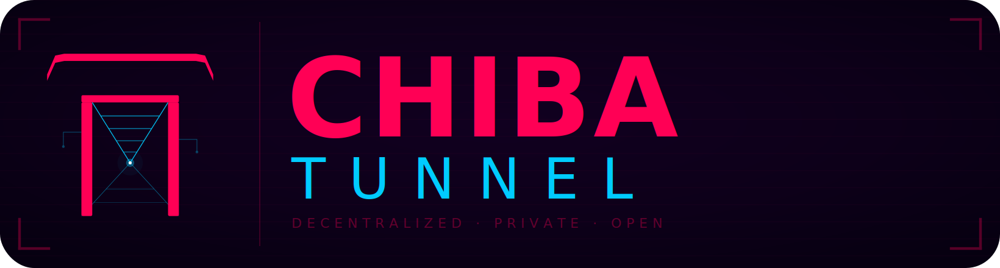
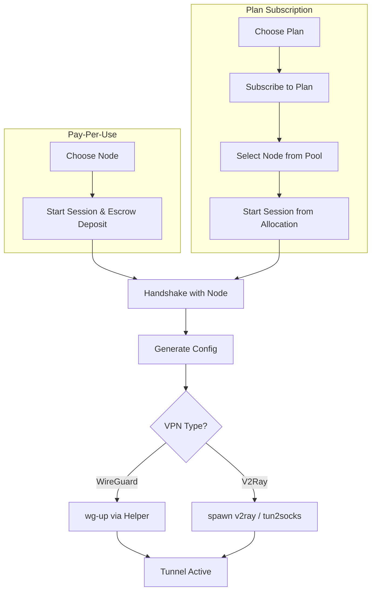
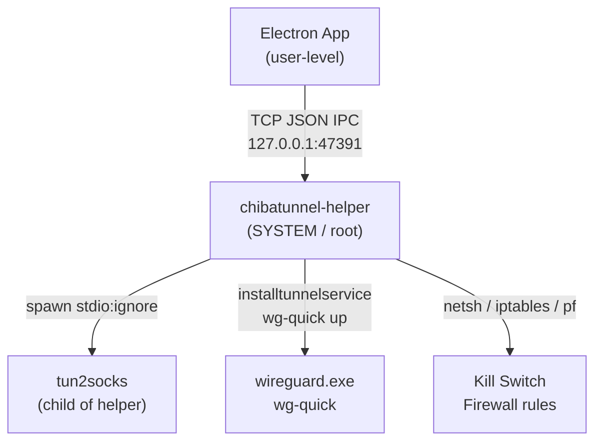
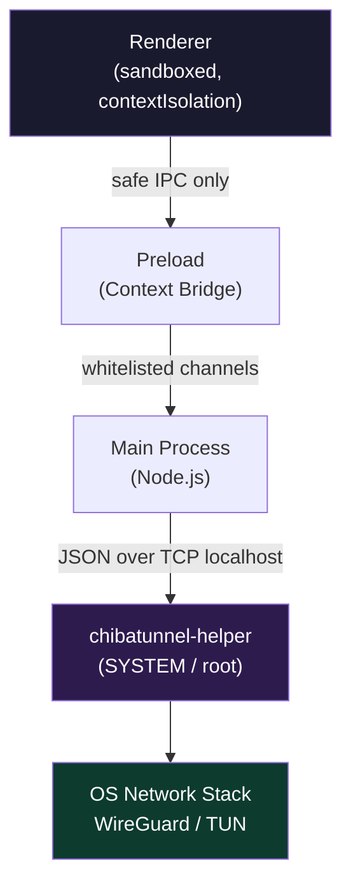

<div align="center">
  
</div>

<br/>

> **Status:** Online | **Protocol:** Sentinel dVPN | **Identity:** Unknown

**ChibaTunnel** is a cyberpunk-styled desktop dVPN client engineered for absolute privacy and censorship resistance. It cuts through centralized corporate firewalls by routing your traffic across a trustless, peer-to-peer node network.

### ⛩️ Built for the Digital Underground ⚡
* **The Stack:** Crafted with **Electron**, **React**, and **TypeScript** for a fluid, resource-efficient desktop experience.
* **The Core:** Powered by the **Sentinel Protocol** ecosystem, ensuring no central logs, no single points of failure, and complete user sovereignty.
* **The Armor:** Dual-engine routing utilizing **WireGuard** for raw speed and **V2Ray** for stealth obfuscation through restrictive networks.

*An open-source gateway wrapped in electric cyan and neon magenta. Welcome to the Street.*

## ⚠️ Disclaimer
This application is open source and was created for the Sentinel community. **100%** of the client code was created by AI. I wanted to play around a bit, but I just supervised. This shows how the power of the [sentinel-js-sdk](https://github.com/sentinel-official/sentinel-js-sdk/) combined with a tool like AI can create something amazing! A simple prompt like "create a VPN client using the SDK documented at https://sentinel-official.github.io/sentinel-js-sdk/: " is all it takes. The source of the nodes is: https://sentnodes.com/ Thanks! 💙 I'm not sure everything works perfectly, especially on Winzozz, but I'm pretty confident on Linux 😎.

A high-performance, cyberpunk-styled desktop application for the [Sentinel](https://sentinel.co)
Decentralised VPN network. Built with **Electron**, **React**, and **TypeScript**, this client
provides a secure, private, and censorship-resistant internet experience on the Cosmos SDK ecosystem.

---

## ✨ Key Features

### 🌍 Multilingual Support (i18n)
Full internationalisation for **9 languages** with dynamic switching:
**English, Italiano, Русский, Español, Deutsch, Français, 中文, فارسی, العربية**
Native **RTL (Right-to-Left)** support with full UI mirroring for Arabic and Persian.

### 🌐 Node Discovery
- **3D Interactive Globe** — explore the Sentinel network via a D3.js orthographic globe.
- **Advanced Filtering** — by city, country, status, provider type, and whitelist.
- **Bookmarking** — save favourite nodes for instant reconnect.

### 🔐 Security
- **Main Process Isolation** — mnemonics and private keys live exclusively in the Electron main process. They never cross the IPC bridge to the sandboxed renderer.
- **OS-Native Encryption** — credentials encrypted via `safeStorage` (macOS Keychain, Windows DPAPI, Linux libsecret).
- **Hardened Sandboxing** — renderer runs with `contextIsolation: true`.

### 🛡️ VPN Engines
- **WireGuard** — high-performance kernel-level tunnels.
- **V2Ray** — obfuscated proxy (VMess/VLess) for restricted networks.
- **Transparent Proxy** — route all system traffic through V2Ray via `tun2socks`.
- **Kill Switch** — leak protection via `iptables` (Linux), `pf` (macOS), Windows Firewall.
- **Split Tunneling** — route specific subnets only (WireGuard).
- **DNS over HTTPS** — Cloudflare, Google, NextDNS, and custom resolvers.

### 🔧 Privileged Helper Service
All operations requiring elevated privileges are delegated to a background service
(`chibatunnel-helper`) that is installed once and runs silently thereafter.
No repeated password prompts or UAC dialogs during normal use.

- **Windows**: a Scheduled Task running as `SYSTEM` is configured by the installer.
- **Linux**: a `systemd` service installed by the package — `apt install` handles it automatically.
- **macOS**: a `LaunchDaemon` installed on first launch with a single password prompt.

---

## 🏗️ Architecture

### Connection Lifecycle



### Privileged Operations Flow



**Why a separate helper?**
Without it, spawning `tun2socks` from Electron via a PowerShell UAC wrapper caused
`await` to hang indefinitely — the daemon inherited Electron's pipe handles and the
OS never closed them. The helper eliminates this by owning all long-lived processes
in its own process tree with `stdio: 'ignore'`.

### Multi-Wallet Management

- Import multiple BIP-39 mnemonics.
- Live balance tracking for DVPN and IBC tokens.
- On-chain session monitoring: view and cancel active P2P sessions.

---

## 🚀 Getting Started

### Prerequisites

| Dependency | Platform | How it's handled |
|-----------|----------|-----------------|
| Node.js ≥ 18 | All | Build toolchain — install manually |
| `wg-quick` | Linux | **Auto-installed** as package dependency |
| `wg-quick` | macOS | `brew install wireguard-tools` (guided in-app) |
| WireGuard | Windows | **Bundled** — `wireguard.exe` included in installer |
| `v2ray` | All | **Bundled** — included in installer |
| `tun2socks` | All | **Bundled** — included in installer |
| `wintun.dll` | Windows | **Bundled** — included alongside tun2socks |

> **Note for Linux AppImage users**: if `wg-quick` is not already installed,
> the app will display the correct install command for your distribution.

### Development Setup

```bash
# Install dependencies
npm install

# Terminal 1 — start the privileged helper (elevated terminal required)
npm run dev:helper

# Terminal 2 — start Electron with hot-reload
npm run dev
```

> The helper must be started first. It runs on `127.0.0.1:47391`.

### Build

```bash
npm run build          # JS bundles only
npm run build:helper:win    # helper EXE for Windows
npm run build:helper:linux  # helper binary for Linux
npm run build:helper:mac    # helper binary for macOS
```

---

## 📦 Distribution

Binaries for Linux, Windows, and macOS are built and published automatically
via GitHub Actions on every version tag push.

| Target | Command | Output |
|--------|---------|--------|
| **Linux** | `npm run dist:linux` | `.deb`, `.AppImage`, `.rpm`, `.pacman` |
| **Windows** | `npm run dist:win` | `.exe` (NSIS installer) |
| **macOS** | `npm run dist:mac` | `.dmg` |

The CI workflow downloads and bundles all third-party binaries (tun2socks, v2ray,
wireguard, wintun) automatically. No manual binary management is required.

---

## 📁 Project Structure

```text
chibatunnel/
├── helper/
│   ├── chibatunnel-helper.ts   # Privileged service (all platforms)
│   └── tsconfig.json           # Standalone TS config for pkg build
├── build/
│   ├── installer.nsh           # NSIS hooks: Scheduled Task install/remove
│   └── linux/
│       ├── postinst.sh         # systemd install (deb/rpm/pacman)
│       └── postrm.sh           # systemd teardown (deb/rpm/pacman)
├── src/
│   ├── main/
│   │   ├── index.ts            # IPC handlers, app lifecycle
│   │   ├── helper-client.ts    # TCP client for chibatunnel-helper
│   │   └── v2ray-process.ts    # V2Ray spawn with explicit binary path
│   ├── preload/                # Secure Context Bridge
│   └── renderer/               # React UI
│       ├── locales/            # i18n JSON (EN, IT, RU, FA, AR, ZH, ES, DE, FR)
│       ├── components/
│       │   ├── Globe/          # 3D D3.js visualisation
│       │   ├── Nodes/          # Sorting & filtering tables
│       │   ├── Wallet/         # BIP-39 management
│       │   └── Sessions/       # On-chain session control
│       └── styles/             # Cyberpunk CSS (variable-based theme)
└── ai-context/                 # Implementation docs for AI-assisted development
    ├── ai-context-privileged-helper.md
    └── macos-helper-implementation.md
```

---

## 🛡️ Security Model



**Threat model notes**:
- Mnemonics never leave the main process
- The IPC surface between renderer and main is minimal and typed
- The helper accepts connections only on localhost — not exposed to the network
- All privileged commands are validated and type-checked before execution

---

## ⚖️ License

Open-source. See `LICENSE` for details.
Built with ❤️ by the Sentinel Community.